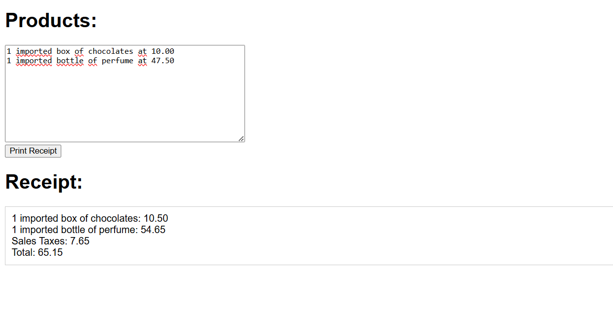

## Methods of execution of an HTML File

**1. Double-Clicking the File (Simplest Method):**

- Double-click the file `print_receipt.html`. Your default web browser (e.g., Chrome, Firefox, Safari, Edge) will automatically open the file and display its contents.

**2. Right-Clicking and Choosing a Browser:**

- Locate the `print_receipt.html` file
- Right-click on the file.
- In the context menu that appears, select "Open with" (or a similar option).
- Choose your preferred web browser from the list.

**3. Opening from within a Browser:**

- Open your web browser.
- Press `Ctrl + O` (Windows/Linux) or `Cmd + O` (macOS) to open the "Open File" dialog.  Alternatively, you can usually find an "Open File" option in the browser's menu (often under "File").
- Navigate to the location of `print_receipt.html` file and select it.
- Click "Open."

**4. Dragging and Dropping into a Browser:**

- Open your web browser.
- Locate the `print_receipt.html` file on your computer.
- Click and drag the HTML file icon directly into the browser window. Release the mouse button to drop the file. The browser will then load and display the HTML content.

---

After open the file in the browser, you should see the page below

**5. Copy and paste the products details into the `Products` text area.**

**6. Click on `Print Receipt` button and the result must be shown in the `Receipt` text area.**
